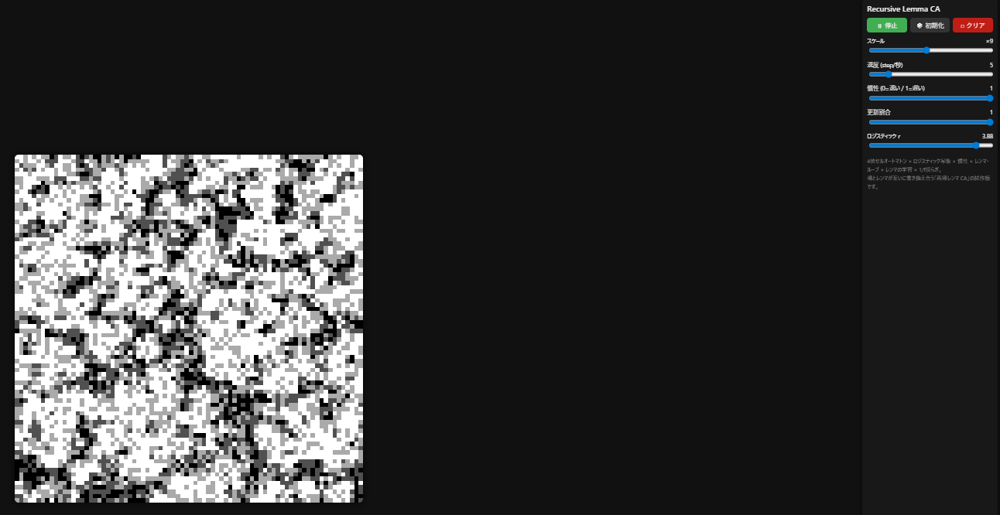

# Recursive Lemma CA（再帰レンマ 4値ロジスティック・スキン + 1/f揺らぎ）

  

**Recursive Lemma CA** は、4値セルオートマトンに  
**近傍平均 × ロジスティック写像 × 慣性 × レンマ・ループ × レンマの学習 × 1/f揺らぎ**  
を組み合わせた「再帰レンマ CA」の試作版です。

- 盤面（場）は、ロジスティック + 慣性 + 1/f揺らぎで「皮膚／雲／迷路」のように動き続ける  
- 各 3×3 パターンには固有の **レンマ（lemma）** が紐づき、
  - 内部にループ状態（phase）を持ち
  - その時点の phase に応じて「明るさの ±1 バイアス」をかける
- レンマ自身も、自分が出した出力の「退屈さ（flatScore）」を見ながら、
  - cycle / bias / rOffset を少しずつ変異していく

という意味で、**「場がレンマを変え、レンマが場を変える」** 再帰構造になっています。

---

## 🔗 実行ページ

（GitHub Pages で公開したら、ここにURLを入れてください）

例：

https://masato-nasu.github.io/recursive-lemma-ca/

スマートフォンのブラウザで開くと、  
「ホーム画面に追加」で **PWA（インストール型アプリ）** として使えます。

---

## SCREENSHOT

- `screenshot.png`  
  - 本リポジトリのルートに配置。  
  - 実行中の「好きな相」をキャプチャして差し替えてください。  
  - README 冒頭の `` で参照しています。

---

## 🧮 仕組み（ざっくり）

盤面は `N×N` のグリッドで、各セルは **0〜3 の 4値** を取ります。

- `0` … 黒  
- `1` … 濃い灰  
- `2` … 薄い灰  
- `3` … 白  

1ステップの更新は、ざっくり次のように行われます。

### 1. 3×3 パターン → レンマID

各セルについて、3×3 近傍（トーラス境界）を見て：

- 4値を base-4 で 9桁つなげた整数を **patternId** として計算
- `patternId` ごとに 1つの **レンマ（lemma）** が対応
- レンマがまだ存在しなければ、その場でランダム初期化

### 2. レンマの内部構造

各レンマは、だいたい次の情報を持ちます：

- `phase` … いま何段目か（0〜LEMMA_PHASES-1）  
- `cycle[phase]` … 各段に対応する **±1 補正（-1,0,+1）** のループ  
- `rOffset` … ロジスティック写像の `r` に足す局所バイアス  
- `bias` … 明るさ寄り／暗さ寄りのバイアス（連続値）  
- `useCount` … そのレンマが何回使われたか  
- `flatScore` … 出力がどれくらい「変化していたか」の指標（小さいほど単調）  
- `lastV` … 最後に出力したセル値

### 3. レンマ・ループ（L0 → L1 → …）

あるセルの 3×3 パターンから `patternId` を求め、そのレンマを取得したら：

- `delta = lemma.cycle[lemma.phase]` を取り出す（-1/0/+1）  
- `lemma.phase = (lemma.phase + 1) % LEMMA_PHASES` で **輪っか状に進める**

これにより、**「同じ 3×3 パターンでも、出現するたびに少し違うバイアス」** がかかるようになります。

### 4. 近傍平均 → ロジスティック写像（ベース更新）

- 3×3 の値の平均 `m`（0〜3）を計算し、`u = m/3` として 0〜1 に正規化。
- グローバルな `r_slider` に、
  - 時間方向の **1/fノイズ** を足した `rGlobal`
  - さらにレンマ固有の `rOffset` を足した `rLocal`
- `u' = rLocal * u * (1 - u)` のロジスティック写像を適用。
- `lemma.bias` も連続値として `u'` に少しだけ足し込み、0〜1 にクリップ。
- `vBase = floor(u' * 4)` として 0〜3 に量子化。

### 5. レンマによる ±1 修飾

- レンマループから得た `delta ∈ {-1,0,+1}` を使い、  
  `vLemmaFloat = vBase + delta * 0.7` のように弱く補正。
- 0〜3 にクリップして `vLemma` とします。

### 6. 慣性ブレンド & 部分更新

- 前の状態 `oldV` と `vLemma` を  
  `mixed = (1 - α) * oldV + α * vLemma` で混ぜ、丸めて 0〜3 に戻す。  
- 確率 `p` で新しい値に更新し、`1 - p` では **あえて oldV を残す**。

これにより、**場は「ねっとりした皮膚」のように動き続けます。**

### 7. レンマの学習（再帰部分）

各セルで vNew が確定したあと、そのセルに関与したレンマに対して：

- `diff = |vNew - lemma.lastV|` を計算し、  
  `flatScore = 0.9 * flatScore + 0.1 * diff` で更新
- `lastV = vNew` に更新

さらに、**一定ステップごとに全レンマをざっと眺めて：**

- `useCount` が十分大きく、かつ `flatScore` がしきい値未満（＝単調すぎる）なレンマだけ、
  - `cycle` のうち 1つの段をランダムに別の値（-1/0/+1）に変える
  - `bias` と `rOffset` を少しだけランダムウォークさせる
  - `flatScore` をリセット気味にして、また様子を見る

これにより、

> - 場（CA の状態）はレンマの出力に影響され、  
> - レンマは「自分が出した結果の退屈さ」を見て、内部ループやバイアスを変える

という意味で、**「場 ⇄ レンマ」の再帰ループ**がゆっくり回り続ける構造になっています。

### 8. 黒のリシード

- 盤面全体の黒セル（値0）がほとんど消えると、
  - ランダムにごく一部のセルを黒に戻す  
- 完全に真っ白に死ぬのを防ぐ「蘇生装置」です。

---

## 🕹 操作方法

右側のコントロールパネルから挙動を調整できます。

- **スケール** … セルの大きさ（ピクセル）  
- **速度** … 1秒あたりのステップ数  
- **慣性** … 0 に近いほどサラサラ、1 に近いほど“ねっとり”変化  
- **更新割合** … 1なら全セル更新、小さいほど局所だけじわっと変化  
- **ロジスティック r** … カオス度。3.6〜3.8 付近が「エッジ・オブ・カオス」っぽいゾーンです。  

1/f揺らぎはコード内部で `r` に自動的に乗っているので、  
スライダーは「揺らぎの中心値」を指定するイメージです。

---

## 🧱 設置方法

特別なビルド工程は不要です。  
このリポジトリの中身をそのまま Web サーバに置くだけで動作します。

1. GitHub でリポジトリを作成し、この一式をアップロードする。  
2. 「Settings → Pages」から GitHub Pages を有効化する。  
3. ブラウザで `https://<ユーザー名>.github.io/<リポジトリ名>/` を開く。

スマートフォンのブラウザで開き、  
「ホーム画面に追加」をすると PWA として利用できます。

---

## 📝 メモ

- これはあくまで **v1（試作版）** です。  
- より「レンマ生態系」感を強くするなら：
  - 長期間使われなかったレンマを忘却して再初期化する
  - レンマ同士の競合や「増殖／絶滅」を入れる
  - 1/f揺らぎを `r` だけでなく、「変異の頻度」にも乗せる  
  といった拡張も考えられます。

---

Recursive Lemma CA は、  
**「場」と「レンマ」が互いに書き換え合う再帰構造が、どんな模様として立ち上がるか**  
を眺めるための小さな実験装置です。

気に入った相やパラメータセットが見つかったら、  
スクリーンショットや動画と一緒に「この時点のレンマの状態」として保存してもらえると嬉しいです。
